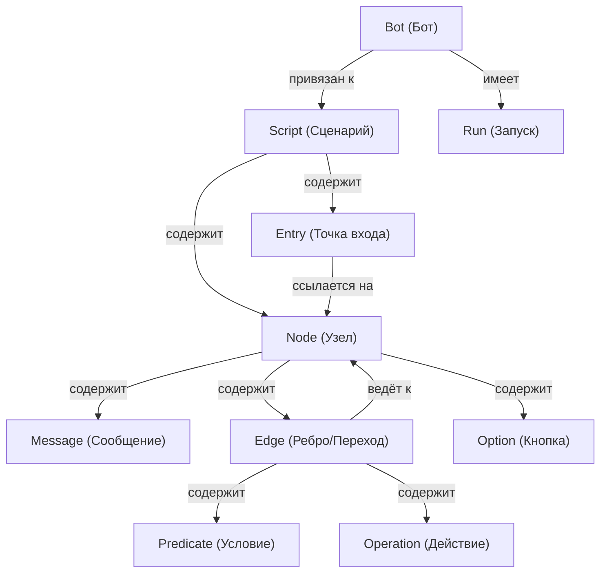
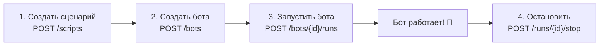
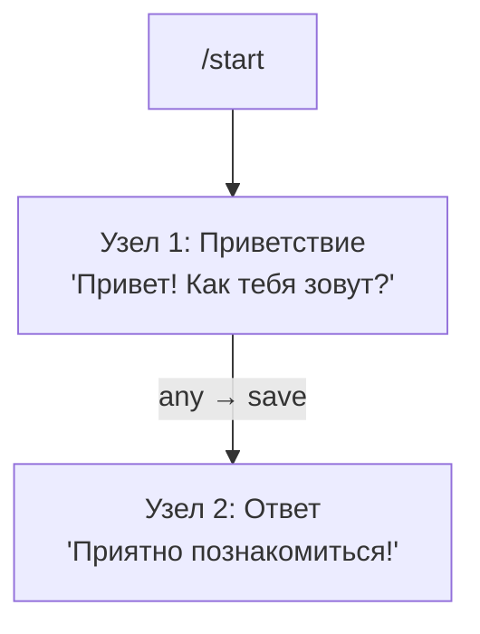
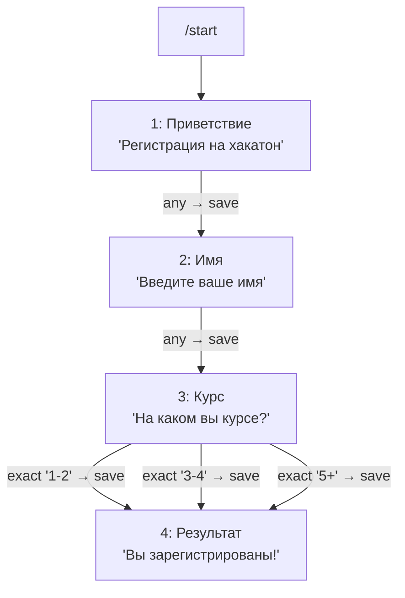
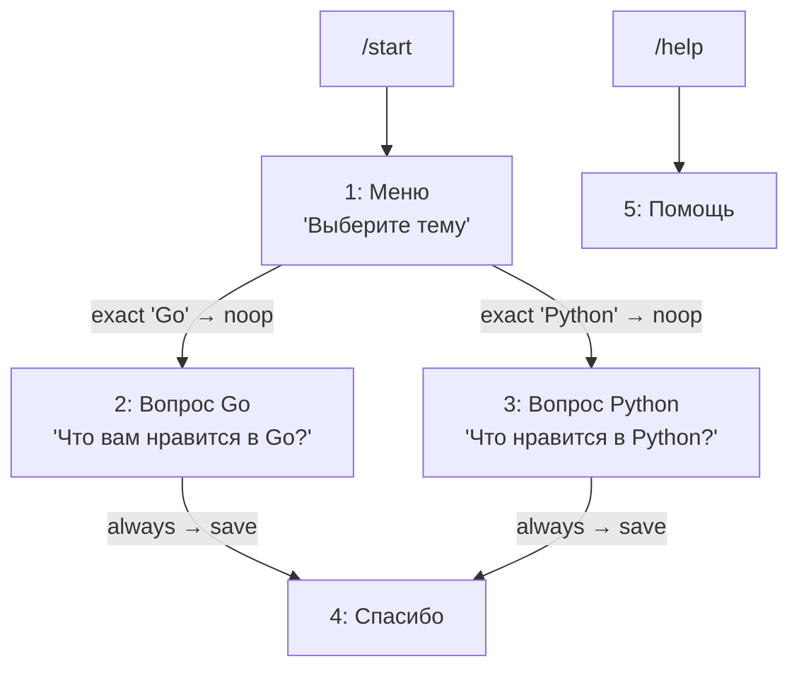

# 📖 ITS Reg — Руководство по созданию Telegram-ботов через JSON API

## Что такое ITS Reg?

**ITS Reg** — это REST API платформа для создания и запуска Telegram-ботов на основе **конечных автоматов (FSM)**. Вы описываете логику бота в виде JSON-сценария (скрипт), привязываете к нему Telegram-токен и запускаете — бот начинает работать.

> [!IMPORTANT]
> Все запросы к API требуют JWT-токен авторизации в заголовке `Authorization: Bearer <token>`.
> Базовый URL: `https://itsreg.itsbmstu.ru/api/v4`

---

## Ключевые понятия



| Понятие | Описание |
|---------|----------|
| **Script** | Сценарий — граф из узлов и точек входа. Описывает всю логику диалога. |
| **Entry** | Точка входа — команда вида `/start`, `/help` и т.д. Указывает, с какого узла начать. |
| **Node** | Узел — одно «состояние» бота: что отправить пользователю и куда перейти дальше. |
| **Message** | Текстовое сообщение, которое бот отправляет при входе в узел. |
| **Edge** | Ребро — переход от одного узла к другому при ответе пользователя. |
| **Predicate** | Условие перехода: `always` (любой ответ), `exact` (точное совпадение), `regex` (регулярка). |
| **Operation** | Что делать с ответом: `noop` (ничего), `save` (сохранить), `append` (добавить к предыдущему). |
| **Option** | Кнопка для ответа (Telegram Reply Keyboard). Прикрепляется к последнему сообщению узла. |
| **Bot** | Сущность, связывающая сценарий с Telegram-токеном. |
| **Run** | Конкретный запуск бота. Статусы: `starting` → `active` → `stopping` → `stopped` (или `failed`). |

---

## Пошаговый процесс



---

## Шаг 1. Создание сценария (Script)

### Структура JSON-запроса

```
POST /api/v3/scripts
Content-Type: application/json
Authorization: Bearer <JWT_TOKEN>
```

```json
{
  "desc": "Описание сценария",
  "nodes": [ ... ],
  "entries": [ ... ]
}
```

### Структура Node (узел)

```json
{
  "state": 1,
  "title": "Название узла",
  "messages": [
    { "text": "Текст сообщения от бота" }
  ],
  "edges": [ ... ],
  "options": ["Кнопка 1", "Кнопка 2"]
}
```

| Поле | Тип | Обязательно | Описание |
|------|-----|:-----------:|----------|
| `state` | `int` | ✅ | Уникальный номер узла (> 0). |
| `title` | `string` | ✅ | Название узла (отображается как заголовок столбца в таблице ответов). |
| `messages` | `Message[]` | ✅ | Минимум одно сообщение. Все отправляются по порядку. |
| `edges` | `Edge[]` | ❌ | Переходы к другим узлам. Если пусто — узел конечный. |
| `options` | `string[]` | ❌ | Кнопки (прикрепляются к последнему сообщению). |

### Структура Edge (ребро/переход)

```json
{
  "predicate": { "type": "always" },
  "to": 2,
  "operation": "save"
}
```

| Поле | Тип | Обязательно | Описание |
|------|-----|:-----------:|----------|
| `predicate` | `Predicate` | ✅ | Условие перехода. |
| `to` | `int` | ✅ | `state` узла, к которому переходим. |
| `operation` | `string` | ✅ | `noop`, `save` или `append`. |

### Типы Predicate (условия перехода)

```json
// 1. always — переход на любое сообщение
{ "type": "always" }

// 2. exact — переход при точном совпадении текста
{ "type": "exact", "text": "Да" }

// 3. regex — переход при совпадении с регулярным выражением
{ "type": "regex", "pattern": "^\\d+$" }
```

> [!TIP]
> Рёбра проверяются **по порядку** — первое совпавшее ребро срабатывает. Ставьте `exact` перед `always`!

### Типы Operation (действия с ответом)

| Operation | Описание | Когда использовать |
|-----------|----------|--------------------|
| `noop` | Ничего не делать с ответом | Меню, промежуточные узлы |
| `save` | Сохранить/перезаписать ответ | Большинство вопросов |
| `append` | Добавить к предыдущему ответу | Множественный выбор |

### Структура Entry (точка входа)

```json
{
  "key": "start",
  "start": 1
}
```

| Поле | Тип | Обязательно | Описание |
|------|-----|:-----------:|----------|
| `key` | `string` | ✅ | Команда без `/`. Например, `"start"` → пользователь пишет `/start`. |
| `start` | `int` | ✅ | `state` узла, с которого начинается сценарий. |

> [!WARNING]
> **Все узлы должны быть достижимы** хотя бы из одной точки входа, иначе API вернёт ошибку валидации.

---

## Пример 1: Простой бот-приветствие

Бот, который при `/start` отправляет приветствие и спрашивает имя:



```json
{
  "desc": "Бот-приветствие",
  "entries": [
    { "key": "start", "start": 1 }
  ],
  "nodes": [
    {
      "state": 1,
      "title": "Имя",
      "messages": [
        { "text": "Привет! 👋 Как тебя зовут?" }
      ],
      "edges": [
        {
          "predicate": { "type": "always" },
          "to": 2,
          "operation": "save"
        }
      ]
    },
    {
      "state": 2,
      "title": "Завершение",
      "messages": [
        { "text": "Приятно познакомиться! 😊" }
      ]
    }
  ]
}
```

**Ответ:**
```json
{
  "scriptID": "abc123def"
}
```

---

## Пример 2: Бот-регистрация на мероприятие



```json
{
  "desc": "Регистрация на хакатон",
  "entries": [
    { "key": "start", "start": 1 }
  ],
  "nodes": [
    {
      "state": 1,
      "title": "Приветствие",
      "messages": [
        { "text": "🚀 Добро пожаловать на регистрацию на хакатон ITS!" },
        { "text": "Для начала, введите ваше полное имя:" }
      ],
      "edges": [
        {
          "predicate": { "type": "always" },
          "to": 2,
          "operation": "save"
        }
      ]
    },
    {
      "state": 2,
      "title": "Имя",
      "messages": [
        { "text": "На каком вы курсе?" }
      ],
      "options": ["1-2", "3-4", "5+"],
      "edges": [
        {
          "predicate": { "type": "exact", "text": "1-2" },
          "to": 3,
          "operation": "save"
        },
        {
          "predicate": { "type": "exact", "text": "3-4" },
          "to": 3,
          "operation": "save"
        },
        {
          "predicate": { "type": "exact", "text": "5+" },
          "to": 3,
          "operation": "save"
        }
      ]
    },
    {
      "state": 3,
      "title": "Курс",
      "messages": [
        { "text": "✅ Вы успешно зарегистрированы! Ждём вас на хакатоне." }
      ]
    }
  ]
}
```

---

## Пример 3: Бот-опрос с множественным выбором и ветвлением



```json
{
  "desc": "Опрос с ветвлением",
  "entries": [
    { "key": "start", "start": 1 },
    { "key": "help", "start": 5 }
  ],
  "nodes": [
    {
      "state": 1,
      "title": "Выбор темы",
      "messages": [
        { "text": "📋 Какой язык программирования вам ближе?" }
      ],
      "options": ["Go", "Python"],
      "edges": [
        {
          "predicate": { "type": "exact", "text": "Go" },
          "to": 2,
          "operation": "noop"
        },
        {
          "predicate": { "type": "exact", "text": "Python" },
          "to": 3,
          "operation": "noop"
        }
      ]
    },
    {
      "state": 2,
      "title": "Мнение о Go",
      "messages": [
        { "text": "Отличный выбор! 🐹 Что вам нравится в Go больше всего?" }
      ],
      "edges": [
        {
          "predicate": { "type": "always" },
          "to": 4,
          "operation": "save"
        }
      ]
    },
    {
      "state": 3,
      "title": "Мнение о Python",
      "messages": [
        { "text": "Классика! 🐍 Что вам нравится в Python больше всего?" }
      ],
      "edges": [
        {
          "predicate": { "type": "always" },
          "to": 4,
          "operation": "save"
        }
      ]
    },
    {
      "state": 4,
      "title": "Завершение",
      "messages": [
        { "text": "Спасибо за ваш ответ! 🙏" }
      ]
    },
    {
      "state": 5,
      "title": "Помощь",
      "messages": [
        { "text": "ℹ️ Это бот-опрос. Напишите /start чтобы начать." }
      ]
    }
  ]
}
```

---

## Пример 4: Множественный выбор с `append`

Бот, который позволяет выбрать несколько навыков и сохранить их все:

```json
{
  "desc": "Выбор навыков",
  "entries": [
    { "key": "start", "start": 1 }
  ],
  "nodes": [
    {
      "state": 1,
      "title": "Навыки",
      "messages": [
        { "text": "Выберите ваши навыки (можно нажать несколько раз, затем 'Готово'):" }
      ],
      "options": ["Frontend", "Backend", "DevOps", "ML", "Готово"],
      "edges": [
        {
          "predicate": { "type": "exact", "text": "Готово" },
          "to": 2,
          "operation": "noop"
        },
        {
          "predicate": { "type": "always" },
          "to": 1,
          "operation": "append"
        }
      ]
    },
    {
      "state": 2,
      "title": "Результат",
      "messages": [
        { "text": "Отлично, ваши навыки сохранены! ✅" }
      ]
    }
  ]
}
```

> [!NOTE]
> Обратите внимание: ребро с `exact "Готово"` стоит **перед** `always`. Порядок рёбер = приоритет.
> Ребро `always` с `operation: "append"` ведёт **на тот же узел** (`to: 1`), создавая цикл для множественного выбора.

---

## Пример 5: Валидация email через regex

```json
{
  "desc": "Сбор email",
  "entries": [
    { "key": "start", "start": 1 }
  ],
  "nodes": [
    {
      "state": 1,
      "title": "Email",
      "messages": [
        { "text": "Введите ваш email:" }
      ],
      "edges": [
        {
          "predicate": {
            "type": "regex",
            "pattern": "^[a-zA-Z0-9._%+-]+@[a-zA-Z0-9.-]+\\.[a-zA-Z]{2,}$"
          },
          "to": 2,
          "operation": "save"
        },
        {
          "predicate": { "type": "always" },
          "to": 1,
          "operation": "noop"
        }
      ]
    },
    {
      "state": 2,
      "title": "Успех",
      "messages": [
        { "text": "✅ Email сохранён! Спасибо." }
      ]
    }
  ]
}
```

> [!TIP]
> Если email не валиден → срабатывает `always` → возврат в тот же узел (бот просто повторно отправит сообщение «Введите ваш email»).

---

## Шаг 2. Создание бота

Получив `scriptID` из шага 1, привязываем к нему Telegram-токен:

```
POST /api/v3/bots
Content-Type: application/json
Authorization: Bearer <JWT_TOKEN>
```

```json
{
  "scriptID": "abc123def",
  "token": "123456:ABC-DEF1234ghIkl-zyx57W2v1u123ew11",
  "desc": "Мой бот для хакатона"
}
```

| Поле | Тип | Обязательно | Описание |
|------|-----|:-----------:|----------|
| `scriptID` | `string` | ✅ | ID сценария, полученный при создании. |
| `token` | `string` | ✅ | Telegram-токен от [@BotFather](https://t.me/BotFather). Уникален. |
| `desc` | `string` | ✅ | Описание бота. |

**Ответ:**
```json
{
  "botID": "xyz789"
}
```

> [!WARNING]
> Токен должен быть **уникальным** — один токен = один бот на платформе.

---

## Шаг 3. Запуск бота

```
POST /api/v3/bots/{botID}/runs
Authorization: Bearer <JWT_TOKEN>
```

Тело запроса не требуется.

**Ответ:**
```json
{
  "runID": "run456"
}
```

Статус запуска проходит по цепочке:

```
starting → active → stopping → stopped
              ↓
            failed
```

Проверить статус:
```
GET /api/v3/runs/{runID}
```

---

## Шаг 4. Остановка бота

```
POST /api/v3/runs/{runID}/stop
Authorization: Bearer <JWT_TOKEN>
```

Возвращает `202 Accepted`. Бот остановится в течение короткого времени.

> [!NOTE]
> Остановить можно только запуск в статусе `active`.

---

## Дополнительные операции

### Обновление сценария

```
PUT /api/v3/scripts/{scriptID}
```

Полностью заменяет сценарий (nodes + entries). Формат тела — аналогичен созданию.

### Обновление бота

```
PATCH /api/v3/bots/{botID}
```

```json
{
  "scriptID": "новый_скрипт",
  "token": "новый_токен",
  "desc": "новое_описание"
}
```

Все поля опциональны — обновляются только указанные.

### Рассылка

```
POST /api/v3/mailings
```

```json
{
  "name": "Напоминание о хакатоне",
  "botID": "xyz789",
  "entryKey": "start",
  "recipients": [123456789, 987654321]
}
```

Рассылка вызывает указанную точку входа (`entryKey`) для списка Telegram user ID.

### Список ботов / сценариев / запусков

```
GET /api/v3/bots
GET /api/v3/scripts
GET /api/v3/runs
GET /api/v3/runs?status=active
GET /api/v3/bots/{botID}/runs
GET /api/v3/mailings
```

### Удаление

```
DELETE /api/v3/bots/{botID}
DELETE /api/v3/scripts/{scriptID}
```

---

## Полный curl-пример: от сценария до запущенного бота

```bash
# Переменные
API="https://itsreg.itsbmstu.ru/api/v3"
TOKEN="ваш_jwt_токен"
TG_TOKEN="123456:ABC-DEF1234ghIkl-zyx57W2v1u123ew11"

# 1. Создаём сценарий
SCRIPT_ID=$(curl -s -X POST "$API/scripts" \
  -H "Authorization: Bearer $TOKEN" \
  -H "Content-Type: application/json" \
  -d '{
    "desc": "Бот-приветствие",
    "entries": [{"key": "start", "start": 1}],
    "nodes": [
      {
        "state": 1,
        "title": "Приветствие",
        "messages": [{"text": "Привет! Как дела?"}],
        "edges": [
          {"predicate": {"type": "always"}, "to": 2, "operation": "save"}
        ]
      },
      {
        "state": 2,
        "title": "Ответ",
        "messages": [{"text": "Спасибо за ответ! 👍"}]
      }
    ]
  }' | jq -r '.scriptID')

echo "Script ID: $SCRIPT_ID"

# 2. Создаём бота
BOT_ID=$(curl -s -X POST "$API/bots" \
  -H "Authorization: Bearer $TOKEN" \
  -H "Content-Type: application/json" \
  -d "{
    \"scriptID\": \"$SCRIPT_ID\",
    \"token\": \"$TG_TOKEN\",
    \"desc\": \"Мой первый бот\"
  }" | jq -r '.botID')

echo "Bot ID: $BOT_ID"

# 3. Запускаем бота
RUN_ID=$(curl -s -X POST "$API/bots/$BOT_ID/runs" \
  -H "Authorization: Bearer $TOKEN" | jq -r '.runID')

echo "Run ID: $RUN_ID"

# 4. Проверяем статус
curl -s "$API/runs/$RUN_ID" \
  -H "Authorization: Bearer $TOKEN" | jq

# 5. Останавливаем (когда нужно)
curl -s -X POST "$API/runs/$RUN_ID/stop" \
  -H "Authorization: Bearer $TOKEN"
```

---

## Правила и ограничения

| Правило | Описание |
|---------|----------|
| `state > 0` | Номер узла должен быть положительным целым числом. |
| Связность графа | Все узлы должны быть достижимы хотя бы из одной точки входа. |
| Минимум 1 сообщение | Каждый узел должен содержать хотя бы одно сообщение. |
| Непустой `title` | Каждый узел должен иметь непустой заголовок. |
| Непустой `key` | Каждая точка входа должна иметь непустой ключ. |
| Уникальность токена | Один Telegram-токен = один бот на платформе. |
| Порядок рёбер | Рёбра проверяются последовательно — первое совпавшее срабатывает. |

---

## Коды ошибок валидации

| Код | Описание |
|-----|----------|
| `script-node-is-not-connected` | Узел недостижим из точек входа. |
| `script-node-not-found` | Ребро ссылается на несуществующий узел. |
| `node-empty-title` | Пустой заголовок узла. |
| `node-has-no-messages` | Узел без сообщений. |
| `message-empty-text` | Пустой текст сообщения. |
| `entry-empty-key` | Пустой ключ точки входа. |
| `state-invalid` | `state ≤ 0`. |
| `bot-empty-script-id` | Не указан ID сценария при создании бота. |
| `bot-empty-token` | Не указан токен при создании бота. |
| `option-empty` | Пустая строка в массиве кнопок. |
| `exact-match-predicate-empty-text` | Пустой `text` в предикате `exact`. |
| `regex-predicate-invalid-pattern` | Невалидное регулярное выражение. |

---

## Развёртывание сервера (для разработчиков)

```bash
# Клонируем репозиторий
git clone https://github.com/bmstu-itstech/itsreg.git
cd itsreg

# Настраиваем окружение
cp .env.example .env
# Редактируем .env: задаём пароли, секрет JWT и т.д.

# Запускаем через Docker Compose
docker compose --env-file .env up -d
```

Сервер будет доступен на порту из `EXTERNAL_HTTP_PORT` (по умолчанию `8400`).
